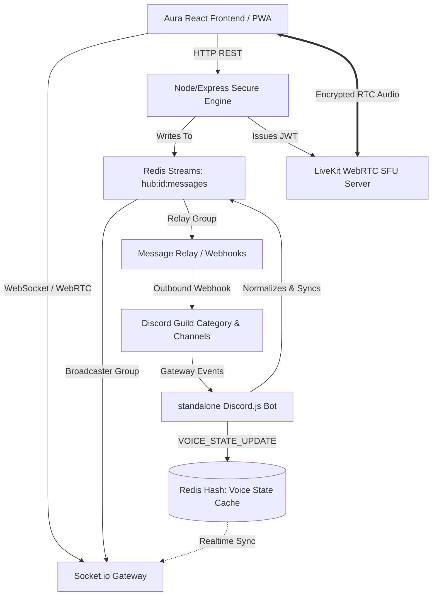

# ⚔️ Aura OS V2 — The Bidirectional Collaboration & Behavioral Operating System
> **"A Cinematic, Distributed Real-Time Operating Framework bridging Native WebRTC, Redis Streams, and Headless Discord Infrastructure."**

[](https://aura-osv1.netlify.app)
[](#)
[](#)
[](#)
[](#)

---

## 🌌 The Vision: Elevating Team Productivity through Distributed Systems Thinking
Most task management platforms fail because they operate in isolated silos, completely detached from the communication channels where actual work happens. **Aura OS V2** solves this by introducing a **Behavioral Operating Framework** that serves as a high-throughput, bidirectional bridge between secure web workspaces and native Discord infrastructure.

Aura OS V2 does not just manage tasks; it gamifies personal and group growth through:
*   **Durable Event Synchronization:** Native WebRTC audio rooms and socket streams mapping team state in real time.
*   **Authoritative Progression & Accountability:** Task routines with streak multipliers, consequence-driven decay, and computer vision validation.
*   **Unified UI Presence:** Features an offline-ready PWA client that encapsulates voice channels, speaking telemetry, and real-time chat directly within the browser—leaving the underlying transport entirely headless.

---

## 🧠 System Architecture & Distributed Engineering
Aura OS V2 is designed around **high-throughput asynchronous messaging, strict service isolation, and distributed state caching**. Rather than hammering external APIs or creating tight runtime coupling, the system leverages a three-tier headless event-driven architecture.

### 🧬 High-Level Architectural Flow


### Key Architectural Pillars
1.  **Durable Asynchronous Event Bus (Redis Streams):** Inbound client messages do not trigger immediate REST calls to Discord. Instead, they are published to Redis Streams. Multiple consumer groups (`socket-broadcaster` and `discord-relay`) process the stream concurrently. This guarantees strictly ordered delivery, decouples external API latency, and enables rapid message history replay with zero database load.
2.  **Optimistic Rendering with State Confirmation:** To achieve a 0ms perceived latency, the **AuraChat UI** implements optimistic message insertion. Messages are immediately rendered in a `pending` visual state, mapped by a temporary client UUID, and upgraded to `confirmed` status only once the Socket.io/Redis Stream gateway broadcasts the authoritative Discord event.
3.  **Real-Time Native Presence Synchronization:** A standalone Discord.js bot monitors voice events (`VOICE_STATE_UPDATE`) directly from the Discord gateway. Member presence (join, leave, mute, deafen, speaking) is immediately cached in Redis hashes (`hub:{id}:voice-members`) and broadcasted natively to Aura clients, creating speaking indicators without loading Discord's client.
4.  **WebRTC SFU Integration (AuraVoice):** Rather than deep-linking or launching the Discord desktop client, Aura OS V2 embeds `@livekit/components-react` directly. The backend issues short-lived JWT tokens on-demand, establishing self-hosted WebRTC rooms per active group channel.

---

## ⚡ Core Feature Matrix

### 1. ⚔️ Headless Discord Synchronization
Aura owns all URLs. The user never leaves `/aura/hubs/:id`. 
*   **Bidirectional Chat Relay:** Posts messages from the web client directly to Discord webhooks with signature verification. Inbound Discord events are captured via gateway listeners, passed to our **Normalization Layer** (resolving mentions to internal IDs and CDN attachments to proxies), and streamed back to active web sessions.
*   **Hub Provisioner:** Creating an Aura Hub automatically initiates a backend transaction that creates a Discord category, designated text/voice channels, and registers webhooks dynamically with `PROVISIONING → ACTIVE` status transitions.

### 2. 🎙️ Real-Time Browser Audio (AuraVoice)
*   **Decoupled Voice Infrastructure:** Integrates native voice conferences via LiveKit WebRTC SFU. Audio processing, NAT traversal, and encrypted voice tracks run fully inside a single browser tab.
*   **Speaking & State Indicators:** Renders native, blinking HUD speaking profiles synced with absolute precision from Discord and LiveKit stream channels.

### 3. 🧠 Authoritative Progression Engine & ML Protocols
*   **Consequence-Based Level Decay:** All XP transitions, streak multipliers (scaling from `+5%` up to `+30%`), and failure penalties are evaluated authoritative backend-side, safeguarding database integrity.
*   **Computer Vision Discipline Mode (CV Integration):** For heavy physical routines, a modular FastAPI/OpenCV sub-service applies MediaPipe's pose-estimation models (tracking flexion/extension angles of shoulders, elbows, and wrists) to count exercises in real-time, locking out browser access until target reps are achieved.
*   **Escaping Procrastination Button:** Attempts to skip focus boundaries trigger an interactive UI routine where the cancel button dynamically calculates cursor vector coordinates and flees across the page, creating high cognitive friction to break procrastination patterns.

---

## 🛠️ The Tech Stack
*   **Frontend:** React 19, Vite 8, React Router DOM 7, Socket.io-client, `@livekit/components-react`
*   **Backend Engine:** Node.js (Express 5, Mongoose 9, Socket.io 4, LiveKit Server SDK, ioredis)
*   **Discord Integration:** Standalone Node Discord.js v14 Gateway daemon
*   **Database & Streaming:** MongoDB Atlas, Redis (ioredis Streams & Cache)
*   **Computer Vision (ML):** Python 3.10+, Google MediaPipe, OpenCV (cv2), FastAPI
*   **Deployment & Ops:** Docker & Docker Compose, Nginx, Render YAML configurations

---

## 🚀 Setting Up the System Locally

### Requirements & Prerequisites
Before launching the system, ensure your machine has:
*   **Node.js** (v18.0.0 or higher)
*   **Docker & Docker Compose** (highly recommended for one-click setup)
*   **Redis** (v7.0+ if running manually)
*   **MongoDB** (v6.0+ if running manually)
*   **Webcam Access** (required for CV Discipline Protocols)

---

### Method A: One-Click Startup (Docker Compose)
The fastest and most stable way to run the multi-container architecture.

1.  **Clone the Repository:**
    ```bash
    git clone https://github.com/Amruth-U-tech/Aura-OS.git
    cd Aura-OS
    ```
2.  **Run the Stack:**
    ```bash
    docker-compose up --build
    ```
    This spins up:
    *   `MongoDB` local daemon on `mongodb://localhost:27017`
    *   `Express API Server` on `http://localhost:5000`
    *   `Vite React Client` mapped on `http://localhost:5173`

---

### Method B: Manual Bare-Metal Installation
If you prefer running individual processes natively for real-time console debugging.

#### 1. Setup the Database & Caching Core
Ensure you have active local instances of **MongoDB** and **Redis** running:
```bash
# Verify Redis local connection
redis-cli ping
# Should return "PONG"
```

#### 2. Configure & Run the Backend Engine
1.  Navigate to the backend directory:
    ```bash
    cd backend
    ```
2.  Install dependencies:
    ```bash
    npm install
    ```
3.  Create a `.env` file based on `.env.example`:
    ```env
    PORT=5000
    MONGO_URI=mongodb://localhost:27017/aura-os-v2
    NODE_ENV=development
    JWT_SECRET=your_super_secure_jwt_secret_token
    JWT_EXPIRES_IN=7d
    FRONTEND_URL=http://localhost:5173
    
    # Cache & Streaming Redis
    REDIS_URL=redis://localhost:6379
    
    # WebRTC Voice Server (LiveKit Integration)
    LK_API_KEY=your_livekit_api_key
    LK_API_SECRET=your_livekit_api_secret
    LK_SERVER_URL=wss://your-livekit-cloud-url
    ```
4.  Start the backend developer server:
    ```bash
    npm run dev
    ```

#### 3. Configure & Launch the Discord Bot Daemon
1.  Navigate to the discord-bot folder:
    ```bash
    cd ../discord-bot
    ```
2.  Install dependencies:
    ```bash
    npm install
    ```
3.  Configure your bot `.env` parameters:
    ```env
    DISCORD_BOT_TOKEN=your_discord_bot_token
    DISCORD_GUILD_ID=your_discord_guild_id
    MONGO_URI=mongodb://localhost:27017/aura-os-v2
    REDIS_URL=redis://localhost:6379
    ```
4.  Start the bot:
    ```bash
    npm run dev
    ```

#### 4. Configure & Launch the React Client
1.  Navigate to the frontend folder:
    ```bash
    cd ../frontend
    ```
2.  Install dependencies:
    ```bash
    npm install
    ```
3.  Start the Vite developer panel:
    ```bash
    npm run dev
    ```
    The web client will immediately be available on `http://localhost:5173`.

---

## 🔮 Live Web Deployment & LiveKit Voice Warning
🚀 **Deploy Link:** [https://aura-osv1.netlify.app](https://aura-osv1.netlify.app)

> [!WARNING]
> **LiveKit Sandbox Ceiling Limits:** AuraVoice's native voice features leverage LiveKit's free-tier sandbox allocation. Because of active usage ceilings and cold-starts, voice rooms might experience connection latency or temporary server timeouts when accessed outside local Docker instances. 

---

## 👥 Engineering & Contribution Guidelines
When making a pull request, adhere strictly to the design constraints of Aura OS V2:
*   **The Replayability Principal:** All user chat messages must strictly flow through Redis Streams (`XADD`). Do not bypass the stream to write directly to database models.
*   **Normalization Isolation:** Keep Discord CDN CDN links isolated. Use the `normalizer` helper utilities to proxy media attachments, keeping Discord payloads hidden from the view layer.
*   **Event-Driven Communication:** Keep components decoupled. State changes must propagate via the global context or Redis Stream listeners, never by direct parent-to-child controller bindings.

---

## 🎯 Placements & System Designer Highlights
For visiting recruiters, this project demonstrates high-caliber full-stack and systems engineering skills:
*   **Distributed State Synchrony:** Built a fully operational headless voice-presence sync, bridging gateway inputs through Redis memory grids to Node and React web clients.
*   **Asynchronous Message Queues:** Successfully designed and integrated Redis Streams with multiple consumer groups to manage asynchronous write-paths and decouple database bottlenecks.
*   **WebRTC Integration:** Integrated enterprise-grade WebRTC SFU systems using LiveKit, demonstrating mastery of socket transport and media channels.
*   **Edge Machine Learning:** Engineered OpenCV and MediaPipe scripts that execute anatomical calculations, proving ability to integrate real-time ML systems into standard applications.

---
*Developed with 🖤 by Amruth. For system queries, reach out or make a Pull Request!*
